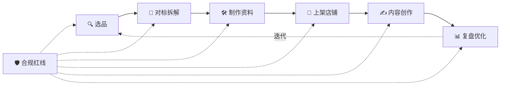

<p align="center">
  <a href="LICENSE"></a>
  
  
  
</p>

<h1 align="center">📕 xhs-virtual-product</h1>

<p align="center">
  <b>把"做小红书虚拟资料"从一份教程，变成一套可复用的 AI 工作流 Skill</b><br>
  选品 → 对标 → 制作 → 上架 → 内容 → 复盘 ｜ 全流程模板 · 公式 · 检查清单 ｜ 守住版权合规红线
</p>

## 💬 加入 AI 破局社群

<h1 align="center"><b>想要加入自媒体 AI 破局社群可联系微信：JZX_AI1203</b></h1>

<p align="center">
  <a href="#-跨工具安装">安装到任意 AI 工具</a> ·
  <a href="#-快速上手">快速上手</a> ·
  <a href="#-目录结构">目录结构</a> ·
  <a href="#%EF%B8%8F-合规声明">合规声明</a> ·
  <a href="CONTRIBUTING.md">贡献</a>
</p>

---

## ✨ 这个 Skill 能给你什么

- 🧭 **7 步闭环 SOP**：选品 → 对标 → 制作 → 上架 → 内容 → 复盘，每一步都有可执行的判断标准。
- 📋 **7 个可填模板**：选品判断表、对标拆解、商品笔记、评论话术、合规清单、7 天计划、标题公式——复制即填。
- 📚 **6 份深度参考**：选品策略、对标拆解、内容创作、开店运营、产品案例、合规红线，按需加载不占上下文。
- 🛡️ **合规红线置顶**：只做原创合规产品，明确点名版权雷区，规避侵权与封号风险。
- 🔌 **跨工具可装**：不仅 WorkBuddy，Claude Code / Cursor / Cline / Codex / Copilot 等都能用（见下方）。

## 🔄 工作流



## 📂 目录结构

```
xhs-virtual-product/
├── SKILL.md                      # 核心：触发条件 + 工作流 + 合规红线
├── references/                   # 详细知识库（按需加载）
│   ├── 01-product-selection.md   # 选品策略
│   ├── 02-competitor-teardown.md # 对标拆解
│   ├── 03-content-creation.md    # 内容创作
│   ├── 04-store-ops.md           # 开店与运营
│   ├── 05-product-cases.md       # 产品案例
│   └── 06-compliance.md          # 合规红线
├── assets/templates/             # 可填模板
│   ├── selection-checklist.md    # 选品判断表
│   ├── competitor-teardown.md    # 对标拆解模板
│   ├── note-template.md          # 商品笔记模板
│   ├── comment-reply.md          # 评论区话术
│   ├── compliance-checklist.md   # 合规检查清单
│   ├── 7day-plan.md              # 七天实操路径
│   └── title-formulas.md         # 标题爆款公式
├── README.md · README.en.md      # 说明（本文件）
├── CONTRIBUTING.md               # 贡献指南
├── PROMO.md                      # 推广文案（三风格）
└── LICENSE                       # MIT
```

## 🌐 跨工具安装

本 Skill 的核心是**纯 Markdown 指令 + 参考文档 + 模板**，因此几乎能装到任何支持「自定义指令 / 系统提示 / 技能目录」的 AI 工具上。

> [!NOTE]
> `SKILL.md` 顶部的 `name` / `description` 是 WorkBuddy 与 Claude Code 的技能约定（用于自动触发）。其他工具会忽略这两行、直接读取正文——不影响使用。

### 兼容性一览

| AI 工具 | 安装方式 | 触发方式 |
| --- | --- | --- |
| **WorkBuddy** | 放入 `~/.workbuddy/skills/` | 提到相关意图自动触发 |
| **Claude Code** | 放入 `~/.claude/skills/` | 自动识别 `SKILL.md` |
| **Cursor** | 写入 `.cursor/rules/xhs.mdc` 或 Rules for AI | `@xhs` / 手动引用 |
| **VS Code + Cline / Roo Code** | 粘贴进 Custom Instructions / `.roo/rules/` | 对话中引用 |
| **Codex / ChatGPT** | 写入 `codex.md` / `AGENTS.md` | 作为项目指令 |
| **GitHub Copilot** | 写入 `.github/copilot-instructions.md` | 自动读取 |
| **任意工具** | 直接把 `SKILL.md` 正文贴进系统提示 | 手动调用 |

### 方式一：技能目录（WorkBuddy / Claude Code）

```bash
git clone https://github.com/chenjin-cmd/xhs-virtual-product.git

# WorkBuddy（用户级，所有项目可用）
mkdir -p ~/.workbuddy/skills
cp -r xhs-virtual-product ~/.workbuddy/skills/xhs-virtual-product

# 或 Claude Code
mkdir -p ~/.claude/skills
cp -r xhs-virtual-product ~/.claude/skills/xhs-virtual-product
```

### 方式二：自定义指令 / 规则文件（Cursor / Cline / Copilot / Codex 等）

把 `SKILL.md` 的正文（连同需要的 `references/` 与 `assets/templates/`）作为该工具的「自定义指令」或「规则文件」内容即可：

```bash
# 例：Cursor —— 合并核心指令为一条 rule
cat xhs-virtual-product/SKILL.md > .cursor/rules/xhs-virtual-product.mdc
# 然后在 Cursor 设置 → Rules for AI 中引用，或对话里 @xhs-virtual-product.mdc

# 例：GitHub Copilot —— 项目级指令
cp xhs-virtual-product/SKILL.md .github/copilot-instructions.md

# 例：Codex / 通用 AGENTS
cp xhs-virtual-product/SKILL.md AGENTS.md
```

> [!TIP]
> 若工具上下文有限，可只保留 `SKILL.md` + 你最常用的 1–2 份 `references/`；模板按需复制即可。

## 🚀 快速上手

**示例 1 · 选品**
> 帮我在「时间管理」方向选 3 个能做的虚拟资料品，用选品判断表打分。

**示例 2 · 对标**
> 拆解这个小红书对标账号：<链接>。用对标拆解模板，标出我能优化的地方。

**示例 3 · 写笔记**
> 给我写一篇「一年级拼音练习」的商品笔记：3 个标题变体（套公式）+ 正文 + 评论区话术。

## ⚠️ 合规声明

> [!WARNING]
> 本 Skill **只支持原创、合规的虚拟资料产品**。严禁用于售卖侵权资料、搬运版权 / 机构内容、站外导流或夸大宣传。平台规则（保证金、类目准入等）变化快，具体以小红书官方为准。使用即表示你同意自行承担合规责任。

## 🤝 贡献

欢迎补充选品方向、案例、模板。见 [CONTRIBUTING.md](CONTRIBUTING.md)。

## 📄 License

[MIT](LICENSE) © chenjin-cmd

---

<p align="center">Made with ❤️ for anyone building original Xiaohongshu virtual products.</p>
